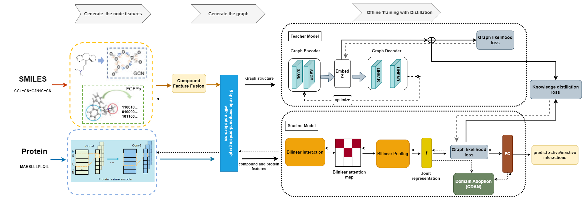

# GraphBAN: A novel out-of-distribution-based compound-protein interaction prediction approach using graph knowledge distillation and bilinear attention network

<div align="left">


[](https://colab.research.google.com/drive/1xs1nS0dGgDq9b0zwYUXVdHFiyE0qwah5?usp=sharing)

</div>


## Introduction
In this study, we introduce GraphBAN, a novel out-of-distribution-based CPI prediction approach using graph knowledge distillation (KD). GraphBAN utilizes a KD module, which includes a graph analysis component (referred to as the "teacher"), and the deep bilinear attention network (BAN). This framework concatenates compound and protein features by considering their pairwise local interactions. Additionally, it incorporates domain adaptation modules to align the interaction representations across different distributions, thus improving generalization for unseen compounds and proteins (referred to as the "student"). GraphBAN operates on a bi-partite graph of CPIs, allowing it to make predictions for both transductive (e.g., test nodes are seen during training) and inductive (e.g., test nodes are not seen during training) links.
Our experiments, conducted using three benchmark datasets under both transductive and inductive settings, demonstrate that GraphBAN outperforms six state-of-the-art baseline models, achieving the highest overall performance.

## Framework

## System Requirements
The source code developed in Python 3.8 using PyTorch 1.7.1. The required python dependencies are given below. GraphBAN is supported for any standard computer and operating system (Windows/macOS/Linux) with enough RAM to run. There is no additional non-standard hardware requirements.

```
torch>=1.7.1
dgl>=0.7.1
dgllife>=0.2.8
numpy>=1.20.2
scikit-learn>=0.24.2
pandas>=1.2.4
prettytable>=2.2.1
rdkit~=2021.03.2
yacs~=0.1.8
```
## Installation Guide
Clone this Github repo and set up a new conda environment. It normally takes about 10 minutes to install on a normal desktop computer.
```
# create a new conda environment
$ conda create --name drugban python=3.8
$ conda activate drugban

# install requried python dependencies
$ conda install pytorch==1.7.1 torchvision==0.8.2 torchaudio==0.7.2 cudatoolkit=10.2 -c pytorch
$ conda install -c dglteam dgl-cuda10.2==0.7.1
$ conda install -c conda-forge rdkit==2021.03.2
$ pip install dgllife==0.2.8
$ pip install -U scikit-learn
$ pip install yacs

# clone the source code of GraphBAN
$ git clone https://github.com/HamidHadipour/GraphBAN
$ cd GraphBAN
```


## Datasets
The `datasets` folder contains all experimental data used in GraphBAN: [BindingDB](https://www.bindingdb.org/bind/index.jsp) [1], [BioSNAP](https://github.com/kexinhuang12345/MolTrans) [2] and [Johnson](https://github.com/lifanchen-simm/transformerCPI) [3]. 
In `datasets/bindingdb` and `datasets/biosnap` folders, we have full data with two random and clustering-based splits for both in-domain and cross-domain experiments.
In `datasets/human` folder, there is full data with transductive split for the in-domain experiment, and with inductive split to alleviate ligand bias.

## Demo
We provide DrugBAN running demo through a cloud Jupyter notebook on [](https://colab.research.google.com/drive/1xs1nS0dGgDq9b0zwYUXVdHFiyE0qwah5?usp=sharing). Note it is based on a small sample dataset of bindingdb due to the resource limitation of a free colab account. This demo only takes 3 minutes to complete the training and testing process. For running DrugBAN on the full dataset, we advise GPU ram >= 8GB and CPU ram >= 16GB.

The **expected output and run time** of demo has been provided in the colab notebook for verification.


## Acknowledgements
This implementation is inspired and partially based on earlier works [4].


## References
    [1] Liu, Tiqing, Yuhmei Lin, Xin Wen, Robert N. Jorissen, and Michael K. Gilson (2007). BindingDB: a web-accessible database of experimentally determined protein–ligand binding affinities. Nucleic acids research, 35(suppl_1), D198-D201.
    [2] Huang, Kexin, Cao Xiao, Lucas M. Glass, and Jimeng Sun (2021). MolTrans: Molecular Interaction Transformer for drug–target interaction prediction. Bioinformatics, 37(6), 830-836.
    [3] Johnson EO, LaVerriere E, Office E, Stanley M, Meyer E, Kawate T, et al. Large-scale chemical–genetics yields new M. tuberculosis inhibitor classes. Nature. 2019 Jul 4;571(7763):72–8. 
    [4] Bai P, Miljković F, John B, Lu H. Interpretable bilinear attention network with domain adaptation improves drug–target prediction. Nat Mach Intell. 2023 Feb 1;5(2):126–36. 

