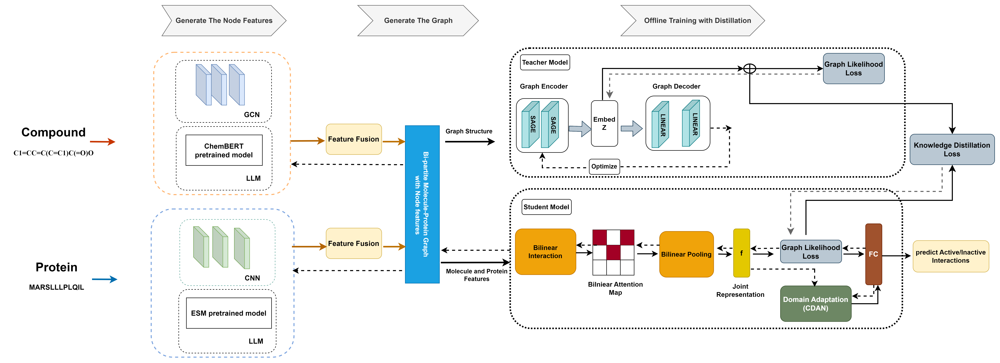

# GraphBAN: A Novel Inductive Graph-Based Approach for Enhanced Prediction of Compound-Protein Interactions

<div align="left">


[](https://colab.research.google.com/drive/183LGl-eJD-ZUw7lqoKlRdw6rw4Sw73W1?usp=sharing)

</div>


## Introduction
In this study, we introduce GraphBAN, a novel out-of-distribution-based CPI prediction approach using graph knowledge distillation (KD). GraphBAN utilizes a KD module, which includes a graph analysis component (referred to as the "teacher"), and the deep bilinear attention network (BAN). This framework concatenates compound and protein features by considering their pairwise local interactions. Additionally, it incorporates domain adaptation modules to align the interaction representations across different distributions, thus improving generalization for unseen compounds and proteins (referred to as the "student"). GraphBAN operates on a bi-partite graph of CPIs, allowing it to make predictions for both transductive (e.g., test nodes are seen during training) and inductive (e.g., test nodes are not seen during training) links.
Our experiments, conducted using five benchmark datasets (BioSNAP, BindingDB, KIBA, C.elegans, PDBbind 2016) under both transductive and inductive settings, demonstrate that GraphBAN outperforms six state-of-the-art baseline models, achieving the highest overall performance.

## Framework



## System Requirements
The source code developed in Python 3.8 using PyTorch 1.7.1. The required python dependencies are given below. GraphBAN is supported for any standard computer and operating system (Windows/macOS/Linux) with enough RAM to run. There is no additional non-standard hardware requirements.

```
torch>=1.7.1
torch-geometric = 2.5.3
torchmetrics = 1.4.1
dgl>=0.7.1
dgllife>=0.2.8
numpy>=1.20.2
scikit-learn>=0.24.2
pandas>=1.2.4
prettytable>=2.2.1
rdkit~=2021.03.2
yacs~=0.1.8
pyarrow
transformers = 4.42.0
```
## Installation Guide
Clone this Github repo and set up a new conda environment. It normally takes about 10 minutes to install on a normal desktop computer.
```
# create a new conda environment
$ conda create --name graphban python=3.11
$ conda activate graphban

# install requried python dependencies
$ conda install pytorch==1.7.1 torchvision==0.8.2 torchaudio==0.7.2 cudatoolkit=10.2 -c pytorch
$ conda install -c dglteam dgl-cuda10.2==0.7.1
$ conda install -c conda-forge rdkit==2022.09.5
$ pip install dgllife==0.2.8
$ pip install -U scikit-learn
$ pip install yacs
$ pip install transformers
$ pip install pyarrow

# clone the source code of GraphBAN
$ git clone https://github.com/HamidHadipour/GraphBAN
$ cd GraphBAN
```
## The instructions provided further are to retrieve the results provided in GraphBAN's paper or for you to testify to the model's performance with your labelled datasets.
## If you have a real-world case to train and test the model, please follow the instructions provided in the/case_study directory. 

## Data
In order to train GraphBAN, you need to provide your data as a CSV file with a header row of 'SMILES', 'Protein', and 'Y' ordered.<br>
The 'Y' indicates binary values  (i.e. 0s and 1s) that are classification indicators.<br>
Currently, we provided the splits of all five datasets used in our paper (BindingDB, BioSNAP, KIBA, C.elegans, and PDBbind 2016) within two split types of transductive and inductive, each within five different seeds. 
## Pre-processing
If you need to bring your dataset and need to split it into transductive and inductive, please use the codes provided in preprocessing/clustering folder.
```
python preprocessing/clustering/inductive_split.py --path_your_dataset --train <path> --val <path> --test <path> --seed <int>
python preprocessing/clustering/transductive_split.py --path_your_dataset --train <path> --val <path> --test <path> --seed <int>
```
## Inductive Training
To train the GraphBAN, run:
```
python run_model.py --train_path <path> --val_path <path> --test_path <path> --seed <int> --mode <[inductive, transductive]> --teacher_path <path>
```
**For example**
```
python run_model.py --train_path Data/sample_data/df_train200.csv --val_path Data/sample_data/df_val.csv --test_path Data/sample_data/df_test.csv --seed 12 --teacher_path Data/sample_data/df_train200_teaqcher_embeddings.parquet
```
The result will be saved in a directory named **result/** that includes the trained model.pth and the prediction scores in a CSV file.

The first three arguments are the paths of your data splits.<br>
The --teacher-path is the path to the parquet file that contains the embedding of your trainset that is captured by the Teacher block of the model.<br>
For the presented data splits in this project, all the teacher embeddings have been provided already.<br>
If you need to capture the teacher embedding for your dataset, run the code below:<br>

```
python teacher_gae.py --train_path <path> --seed <int> --teacher_path <path> --epoch <int>
```
For example 

```
python teacher_gae.py --train_path Data/sample_data/df_train200.csv --seed 12 --teacher_path Data/sample_data/test.parquet --epoch 10
```
--teacher_path should be the path of a parquet file.<br>
## Inductive prediction
To load a trained model and make predictions, run predict.py and specify:

--test_path <path> Path to the data to predict on.<br>
--trained_model <path> Path to the trained .pth file.<br>
--save_dir <path> Path you want to save the predictions.<br>
```
python predictions/predict.py --test_path <path> --trained_model <path> --save_dir <path>
```
**For example**,
```
python predictions/predict.py --test_path Data/biosnap/inductive/seed12/target_test_biosnap12.csv --trained_model predictions/trained_models/biosnap/inductive/seed12/best_model_epoch_45.pth --save_dir biosnap12_predictions.csv

```
## Transductive Training
to train the model in transductive mode, please run the code below. In transductive mode we do not have feature fusion, and student blocks and just use the LLMs to extract compound and protein features plus a GAE to to train on the bi-partite network of CPIs.<br>
```
python transductive_mode/train_transductive_mode.py --train_path <path> --val_path <path> --test_path <path> --seed <int> --save_model <path> --metric_path <path> --prediction_path <path> --h_dimension <int> --epochs <int>
```
It receives the paths for train, validation, and test sets.<br>
Also, a seed set for randomization.<br>
The save mode is the path to save the torch model.pth file.<br>
The metric_path is the address to be set to save the metrics in a .csv file.<br>
The prediction path is to save the predicted probabilities to a .csv file.<br>
The dimension is to set the hidden dimension of the embedding that will be set for each of the compound and protein nodes.<br>
The epoch is to set the number of epochs needed.<br>
**For example**,
```
python transductive_mode/train_transductive_mode.py --train_path Data/kiba/transductive/seed12/train_kiba12.csv --val_path Data/kiba/transductive/seed12/val_kiba12.csv --test_path Data/kiba/transductive/seed12/test_kiba12.csv --seed 12 --save_model Data/kiba12_model.pth --metric_path Data/kiba12_metric.csv --prediction_path Data/kiba12_preds.csv --h_dimension 256 --epochs 10
```
## Transductive prediction
To use the trained transductive models you can run the codes as below,<br>
```
python transductive_mode/predict_transductive.py --test_path <path> --seed <int> --trained_model <path> --metric_path <path> --pred_probs_path <path>
```
**For example**
```
python transductive_mode/predict_transductive.py --test_path Data/kiba/transductive/seed12/test_kiba12.csv --seed 12 --trained_model transductive_mode/trained_models/kiba/kiba_trans_12.pth  --metric_path transductive_mode/kiba12_test_pred_metric.csv --pred_probs_path transductive_mode/kiba12_test_pred.csv
```
## Hyperparameters
In the case that you need to set your hyperparameters, you can check the **config.py** and/or **GraphBAN_DA.yaml** (for inductive settings) and **GraphBAN.yaml** (for transductive settings).

## Demo
We provide GraphBAN running demo through a cloud Jupyter notebook on [](https://colab.research.google.com/drive/183LGl-eJD-ZUw7lqoKlRdw6rw4Sw73W1?usp=sharing). Note: A sample dataset with 200 interactions provided to examining the training procedure. Also, an example of retrieving the prediction scores captured by inductive analysis on the BioSNAP dataset is provided to test a trained model and reproduce the results reported in the paper. <br>
The approximate time needed to install the packages on the Google Colab is 5 minutes.<br>
The approximate time to clone this repository is 3 minutes.<br>
The approximate time to run the training of the sample data with 50 epochs is 8 minutes.<br>
The approximate time to run the prediction with a trained model is 3 minutes.<br>
**Note: To run the Demo on Google Colab it is necessary to use the GPU-enabled version of Colab.**

## Other Folders
**Ablation_study** is the directory that saved the trained models provided for the ablation studies.<br>
**case_study** is the directory that saved the data and trained models provided in our case study section.<br>

## Acknowledgements
This implementation is inspired and partially based on earlier works (DrugBAN).


